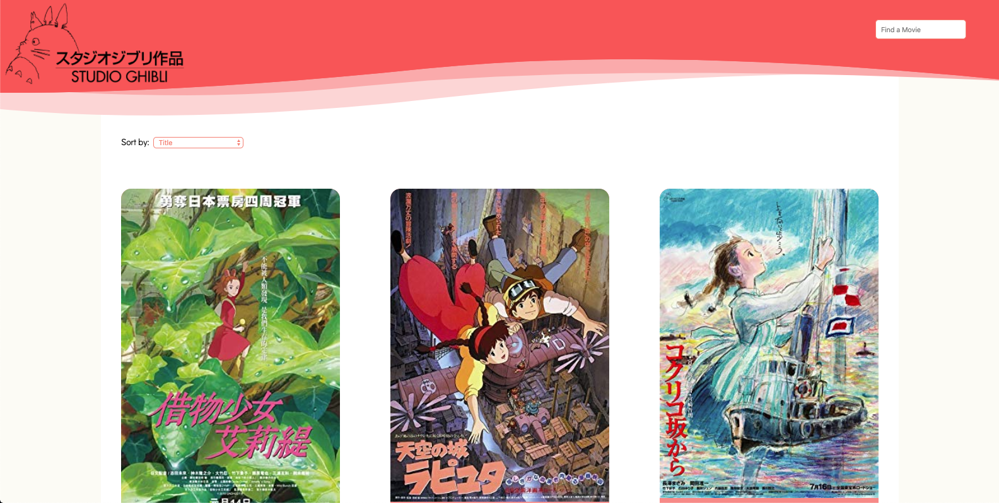

# Studio Ghibli Film Catalogue
This is a catalogue of all Studio Ghibli films, built with React and Redux. On the Home Page, users can see a list of Studio Ghibli films with a corresponding movie poster, title, rating, and year of release. Upon clicking one of these film cards, users can then see more details about their chosen film (full description, director, proudcer, rating, and year of release). Users can also search for a specific title, or can sort by title, rating, oldest to newest, or newest to oldest.

For Film Details, this project uses a [Studio Ghibli API](https://ghibliapi.herokuapp.com/).
For Film Posters, it uses the [IMDB API](http://www.omdbapi.com/).



### Live Demo
To view the live link, [click here](https://studioghiblicatalogue.netlify.com/).

### Technologies Used
* ReactJS
* Redux
* JavaScript
* HTML
* CSS

The loader used in this project was designed by [ilithya on codepen](https://codepen.io/ilithya/pen/WdJLPY).

### 👤 Author

* Github: [@evaveskova](https://github.com/evaveskova)
* Linkedin: [Eva Veskova Jackson](https://www.linkedin.com/in/evaveskova/)

### How to Use

* Visit the live link or clone the project in the terminal by running
```
git clone https://github.com/evaveskova/studio-ghibli-catalogue.git
```
* Open the project and install dependencies
```
npm start
```
* Start the server localhost:3000 
```
npm start
```
* Browse the Page

### Future Feature Plans

* Create seperate pages which will species, characters, or locations from Studio Ghibli movies
* Implement detail pages for each species, character, or location
* Add animations & improve styling.

### 🤝 Contributing

Contributions, issues and feature requests are welcome!

### Show your support

Give a ⭐️ if you like this project!

### 📝 License

This project is [MIT](lic.url) licensed.
